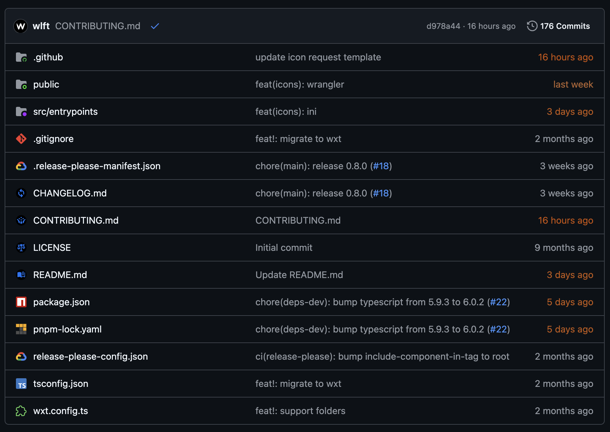

# Better GitHub File Icons

A browser extension to replace github file & folder icons with actual logos/icons.

Additional icons sourced from [Google Material Symbols 3](https://github.com/google/material-design-icons), but they may be modified.

## Files & file extensions that will specifically not be added:

* .txt
* .pb
* .pdf
* .rst
* .dat
* .bin
* .tmp

### Due to complex logos:

* Lerna
* Clang
